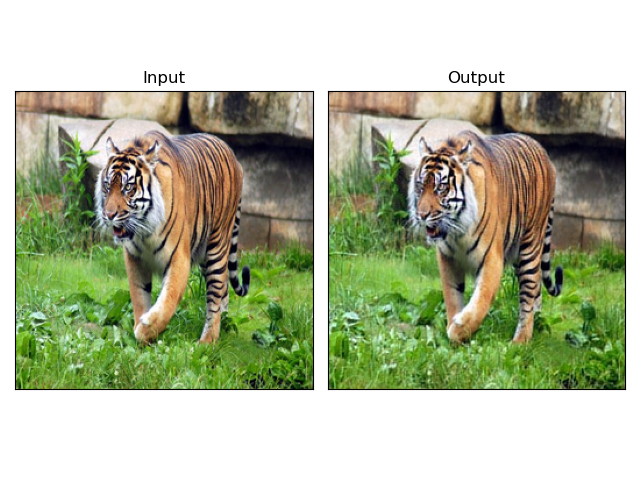

# Variational AutoEncoder

-----

**Table of Contents**

- [Variational AutoEncoder](#variational-autoencoder)
  - [Introduction](#introduction)
  - [Performance](#performance)
  - [Checkpoints](#checkpoints)
  - [License](#license)

## Introduction

This is an Pytorch implementation of Variational AutoEncoder, model structure was inspired by the one used with Stable-Diffusion.

## Performance
The following is the result of training on the ImageNet-1K dataset with 256x256 resolution and 64 latent size for 55100 steps with batch size of 32. The final L1 loss is 0.015656.


## Checkpoints

Checkpoints are in the sub-directory `checkpoints`, and are in the format of ```DATASET_IMAGESIZE_LATENTSIZE_STEPS-BATCHSIZE_LOSS.pt```
## License

`vae` is distributed under the terms of the [MIT](https://spdx.org/licenses/MIT.html) license.
